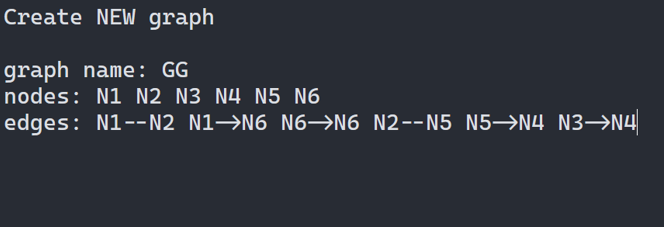
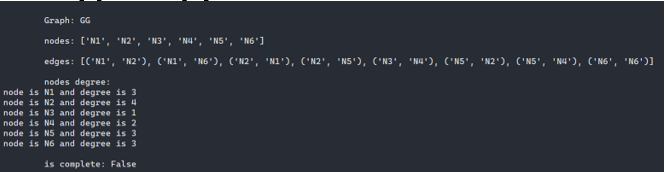
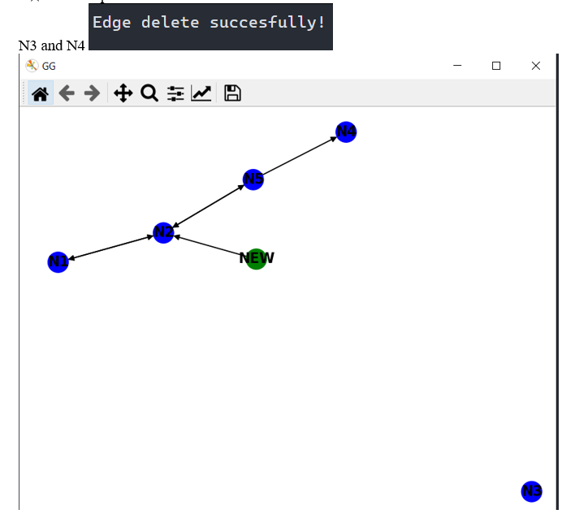

# Graph editor

***My main aim*** was to develop a program that ensures the implementation of
basic operations mathematical modeling for a given mathematical model.

***My result*** is a software product that allows you to edit graph
constructions of various types and perform various actions on them.

## Preparaton
---

Before run a program you should to install all requirements. And I reccomend create a virtual environment for it.

> python -m ven venv
>> venv/Scripts/activate.bat
>>> pip install -r requirements.txt

## Run
---

And now you can to run a programm

> python main.py

## Example
---
This is an example how you can use this editor in practice:

- ***Program start***
  
  

- ***Create new graph***
  
  

- ***Show graph***
  
  

- ***Show graph info***
  
  

- ***Save in gml***
  
  

- ***Add new node***
  
  

- ***change node color***
  
  

- ***Delete node***
  
  

- ***Add new edge***
  
  
  

- ***Edge color and info***
  
  

- ***Delete edge***

  

- ***Work with several graphs***
  
  
  
    
- ***Remove node***
  
  
  

- ***Load graph***
  
  

- ***Find all routes***
  
  

- ***Find subgraph***

  

- ***Make complete graph***

  

- ***Find Eyler cycle***

  